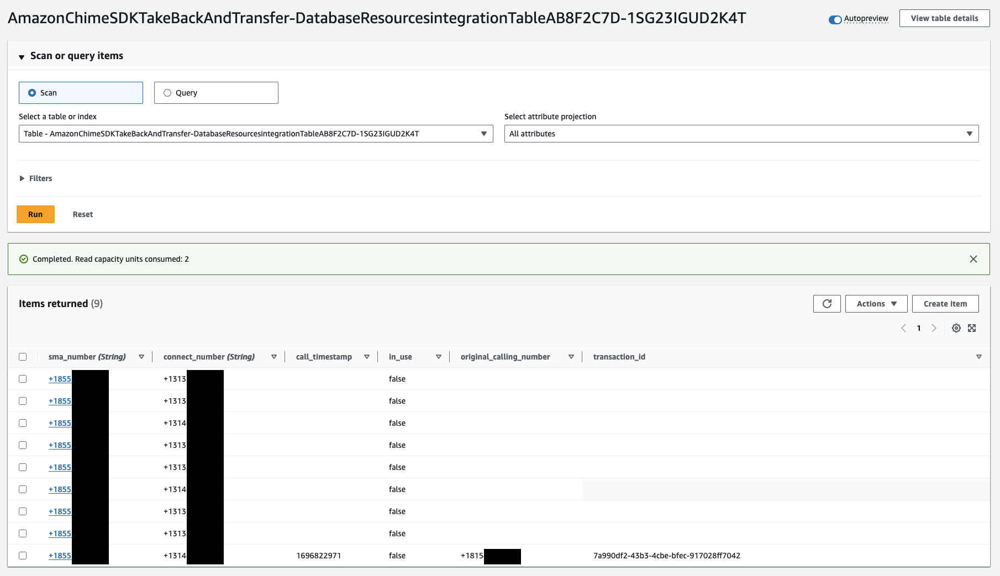
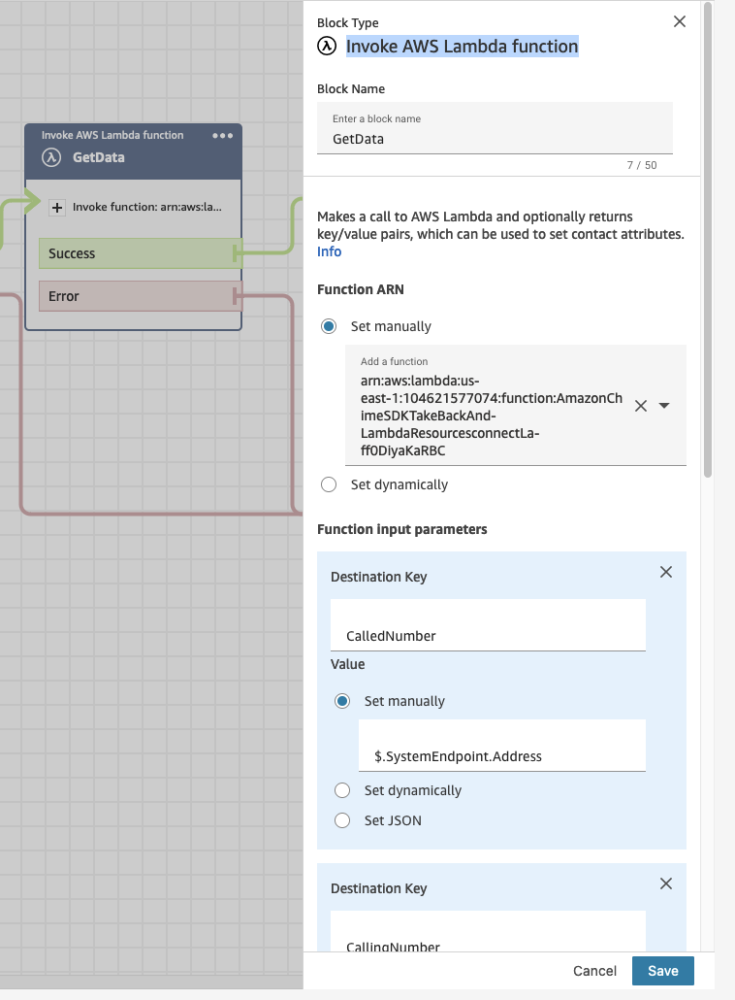
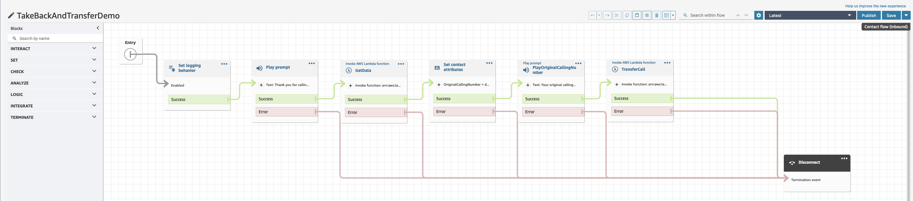

# Amazon Chime SDK Take Back and Transfer

## Overview


## Basic Call Flow

1. Call arrives from PSTN on Amazon Chime SDK SIP media application. This could also be a SIP ingress. For this demo, we will use PSTN.
   1. Call is answered by Amazon Chime SDK SIP media application (LEG-A)
   2. The Lambda function associated with the SMA queries a DynamoDB table (`INTEGRATION_TABLE`) for a phone number combination to use (see [Rolling DNIS](#Rolling-DNIS))
   3. The Lambda function updates the DynamoDB table claiming the combination and stores additional information to be used in Connect
   4. The Lambda function returns an Action to the SMA to [CallAndBridge](https://docs.aws.amazon.com/chime-sdk/latest/dg/call-and-bridge.html) to Connect via the PSTN
2. Connect answers call
   1. Connect plays a prompt
   2. Connect invokes the associated Lambda function passing the called and calling numbers
3. The Lambda function queries the `INTEGRATION_TABLE` using the called and calling numbers to retrieve the `transaction_id`
   1. Using the `transaction_id`, the Lambda function makes an [`update_sip_media_application_call`](https://docs.aws.amazon.com/chime-sdk/latest/APIReference/API_voice-chime_UpdateSipMediaApplicationCall.html) request.
4. The SMA is invoked with [`CALL_UPDATE_REQUESTED`](https://docs.aws.amazon.com/chime-sdk/latest/dg/update-sip-call.html)
   1. The Lambda associated with the SMA reads the `Arguments` that were sent in the `update_sip_media_application_call` and stores them as [`Transaction Attributes`](https://docs.aws.amazon.com/chime-sdk/latest/dg/transaction-attributes.html)
   2. The Lambda updates the `INTEGRATION_TABLE` to remove the combination from being `in_use`
   3. The Lambda function returns a `HANGUP` action directing the call leg between the SMA and Connect (LEG-B) to be hungup.
5. The SMA is invoked with [`ACTION_SUCCESSFUL`](https://docs.aws.amazon.com/chime-sdk/latest/dg/use-case-2.html)
   1. The Lambda returns two actions to the SMA: `SPEAK` and `CALL_AND_BRIDGE` to establish a new call leg between the SMA and a SIP endpoint (LEG-B)
6. The call is answered by a SIP endpoint

## Rolling DNIS

In order to pass information from the SIP media application to Connect, we will use a combination of calling and called numbers to create a unique identifier that can be used to query a DynamoDB table. To create this combination of numbers, we will use several SIP media application numbers and several Connect numbers. This demo will deploy three SMA numbers to be combined with any number of Connect numbers. If three Connect numbers are used, this will result in a total of nine possible combinations.

For example:

|            | 8005557777 | 8005558888 | 8005559999 |
| :--------: | :--------: | :--------: | :--------: |
| 8005551111 |     1      |     4      |     7      |
| 8005552222 |     2      |     5      |     8      |
| 8005553333 |     3      |     6      |     9      |

Using this concept, we can expand the matrix as needed to create more unique combinations.

### Creating the DynamoDB Table

```typescript
this.integrationTable = new Table(this, 'integrationTable', {
  partitionKey: {
    name: 'sma_number',
    type: AttributeType.STRING,
  },
  sortKey: { name: 'connect_number', type: AttributeType.STRING },
  removalPolicy: RemovalPolicy.DESTROY,
  encryption: TableEncryption.AWS_MANAGED,
  billingMode: BillingMode.PAY_PER_REQUEST,
});
```

We will create the DynamoDB table with a [Primary Key and Sort Key](https://docs.aws.amazon.com/amazondynamodb/latest/developerguide/HowItWorks.CoreComponents.html#HowItWorks.CoreComponents.PrimaryKey). These keys will be the SIP media application numbers and the Connect numbers.

Additionally, we will create a [Global Secondary Index](https://docs.aws.amazon.com/amazondynamodb/latest/developerguide/GSI.html) with a Partition Key of `in_use`. This is what we will use to find a combination that is not `in_use`.

```typescript
this.integrationTable.addGlobalSecondaryIndex({
  indexName: 'in_use',
  partitionKey: { name: 'in_use', type: AttributeType.STRING },
  projectionType: ProjectionType.ALL,
});
```

The result will look something like this.



### Querying DynamoDB

When making the call from the SIP media application to Amazon Connect, we will query the Global Secondary Index to find `in_use` equal to `false` to find an unused combination.

```python
response = dynamodb.query(
   TableName=INTEGRATION_TABLE,
   IndexName='in_use',
   KeyConditionExpression='in_use = :false',
   ExpressionAttributeValues={':false': {'S': 'false'}},
   Limit=1
)
```

### Updating DynamoDB

Once we have a combination where `in_use` is `false`, we can claim that combination.

```python
dynamodb.update_item(
   TableName=INTEGRATION_TABLE,
   Key={
      'sma_number': {'S': sma_number},
      'connect_number': {'S': connect_number}
   },
   UpdateExpression='SET \
      transaction_id = :transaction_id, \
      call_timestamp = :current_timestamp, \
      in_use = :true, \
      original_calling_number = :original_calling_number',
   ConditionExpression='attribute_not_exists(in_use) OR in_use = :false',
   ExpressionAttributeValues={
      ':transaction_id': {'S': transaction_id},
      ':original_calling_number': {'S': original_calling_number},
      ':current_timestamp': {'N': str(current_timestamp)},
      ':true': {'S': 'true'},
      ':false': {'S': 'false'},
   },
)
```

This DynamoDB `update_item` will ensure that `in_use` is `false` before updating. If this fails because another call has claimed this combination, we will try again with a new `query`. This can also be used to pass any piece of information from the SIP media application to Connect. In this case, we are passing `original_calling_number` as an additional piece of information that can be used within the Connect contact flow.

### Retrieving the information

Within the Connect contact flow, we can invoke a Lambda function to query the DynamoDB and retrieve any of the information we stored there. First, we will need to pass the `calling_number` and `called_number` to our Lambda function. To do this, we will set a [`Destination Key`](https://docs.aws.amazon.com/connect/latest/adminguide/connect-lambda-functions.html#function-contact-flow) when invoking the Lambda from our Connect contact flow.

#### Invoke AWS Lambda function Configuration



Using the input parameters, we are able to pass the `calling_number` and `called_number` to the Lambda function and use these to query the DynamoDB table. With this, we can find the `transaction_id` of the SIP media application or any other piece of information that is passed between the SIP media application the Connect contact flow.

#### Lambda function

Within the Lambda function, we will use this data to query the DynamoDB Table.

```python
sma_number = event['Details']['Parameters']['CallingNumber']
connect_number = event['Details']['Parameters']['CalledNumber']
call_data = get_data(sma_number, connect_number)

def get_data(sma_number, connect_number):
    logger.info("%s Getting latest data for calling number: %s and called number: %s", LOG_PREFIX, sma_number, connect_number)
    response = dynamodb.query(
        TableName=INTEGRATION_TABLE,
        KeyConditionExpression="sma_number = :sma_number and connect_number = :connect_number",
        ExpressionAttributeValues={
            ":sma_number": {"S": sma_number},
            ":connect_number": {"S": connect_number}
        },
        Limit=1,
        ScanIndexForward=False
        )

    if response["Count"] > 0:
        item = response["Items"][0]
        logger.info("%s Table returned: %s", LOG_PREFIX, json.dumps(item))
        return item
    else:
        return None
```

## Updating the SIP media application call

In order to transfer the call, we can use the `transaction_id` of the call to `update_sip_media_application_call` on the SIP media application to manipulate the existing call. In this demo, we will be using it to disconnect the call from Connect and establish a new call to a SIP endpoint. To do this, we will pass arguments to the SIP media application. This can be used to pass any piece of information available in the Connect contact flow back to the SIP media application if it is passed to the Lambda function.

```python
arguments = {
   "TransferTarget": VOICE_CONNECTOR_PHONE_NUMBER,
   "TransferTargetArn": VOICE_CONNECTOR_ARN,
   "Transfer": "true",
}
response = chime_sdk.update_sip_media_application_call(
   SipMediaApplicationId=SIP_MEDIA_APPLICATION_ID,
   TransactionId=transaction_id,
   Arguments=arguments
)
```

## Taking back the call

When the SIP media application has been updated with `update_sip_media_application_call` we will receive a new invocation with an `InvocationEventType` of `CALL_UPDATE_REQUESTED` along with the arguments passed from the Connect lambda. These arguments will be stored in the `Transaction Attributes` of the SIP media application for future use.

```python
transaction_attributes['target_number'] = event['ActionData']['Parameters']['Arguments']['TransferTarget']
transaction_attributes['target_arn'] = event['ActionData']['Parameters']['Arguments']['TransferTargetArn']
transaction_attributes['transfer'] = 'true'
transaction_attributes['active_call_to_connect'] = 'false'
remove_call_from_integration_table(transaction_attributes['sma_number'], transaction_attributes['connect_number'])
actions = [
   hangup(event['CallDetails']['Participants'][1]['CallId']),
]
```

We will remove the call from the table by setting `in_use` to `false` so that another call can use that combination and then we will send a `HANGUP` action to the SIP media application that will tear down the call between the SIP media application and Connect.

## Establishing a new call

When the `HANGUP` completes successfully, we will use the `Transaction Attributes` previously stored to establish a new call to our SIP endpoint. In this demo, an Asterisk server has been created that will answer a SIP call. In production, this could be any SIP endpoint that is needed.

```python
if event_type == 'ACTION_SUCCESSFUL' and event['ActionData']['Type'] == 'Hangup' and transaction_attributes.get('transfer', 'false') == 'true':
   logger.info('%s TRANSFER', LOG_PREFIX)
   target_number = transaction_attributes['target_number']
   target_arn = transaction_attributes['target_arn']
   sma_number = transaction_attributes['sma_number']
   original_calling_number = transaction_attributes['original_calling_number']
   actions = [
      speak('Please hold while we connect you', event['CallDetails']['Participants'][0]['CallId']),
      call_and_bridge_sip(sma_number, target_number, target_arn, original_calling_number)
   ]
```

Here we check to ensure that we should transfer the call to a new endpoint and use the information stored in the `Transaction Attributes` to establish a new call. We have maintained `LEG-A` between the original caller and the SIP media application. Now, we will establish a new `LEG-B` towards a SIP endpoint.

```python
def call_and_bridge_sip(sma_number, target_number, target_arn, original_calling_number):
    return {
        "Type": "CallAndBridge",
        "Parameters": {
            "CallTimeoutSeconds": 30,
            "CallerIdNumber": sma_number,
            "Endpoints": [
                {
                    "BridgeEndpointType": "AWS",
                    "Arn": target_arn,
                    "Uri": target_number,
                }
            ],
            "SipHeaders": {
                "X-Original-Calling-Number": original_calling_number
            }
        }
     }
```

This function will be used to return an `Action` to the SIP media application that will make a SIP call using the Amazon Chime SDK Voice Connector referenced in the `Arn`. We can also pass information to this SIP endpoint using `SipHeaders`.

## Deployment

### Deploy Requirements

- yarn installed

### Deployment Options

This demo can be deployed with an existing Connect instance or not. It can also be deployed with existing phone numbers or not.

#### Existing Connect Instance

To use an existing Connect instance, add the instance ID to the `.env` file.

```bash
CONNECT_INSTANCE_ID='11111111-2222-3333-4444-555555555555'
```

If this is not included in the `.env` file, a new Connect instance will be created.

#### Existing Phone Numbers

To use existing Connect phone numbers, add the numbers to the `.env` file.

```bash
CONNECT_NUMBERS='+18005551111,+18005552222,+18005553333'
```

If these are not included in the `.env` file, new Connect phone numbers will be created.

### Contact Flow

A new Contact Flow will created to support this demo.



This Contact Flow will support the basic features described in this demo. It will:

1. Enable Logging
2. Play a simple message
3. Invoke the Lambda to query the DynamoDB
4. Set a contact attribute based on the response from the Lambda
5. Play a message using the contact attribute
6. Invoke the Lambda to transfer the call

### Deploy Stack

To deploy this stack, using your configured AWS credentials:

```
yarn launch
```

### Testing

Once configured, you can make a call to the `AmazonChimeSDKTakeBackAndTransfer.EntryNumber` that is shown in the CDK output. This call will first establish to the SIP media application, then bridge to the Connect instance, disconnect from Connect, and establish a new call to the demo Asterisk.

The included demo Asterisk is a simple PBX that can be used to test this call. You can use the `DistributionURL` included in the CDK output to login to the included PBX to test connectivity. If you do not log in to to this PBX, the call will be answered by the PBX and a sample `wav` file will be played. Information passed to the PBX can be seen in the `X-Original-Calling-Number` that is delivered to the PBX.

## Cleanup

```
yarn cdk destroy
```
